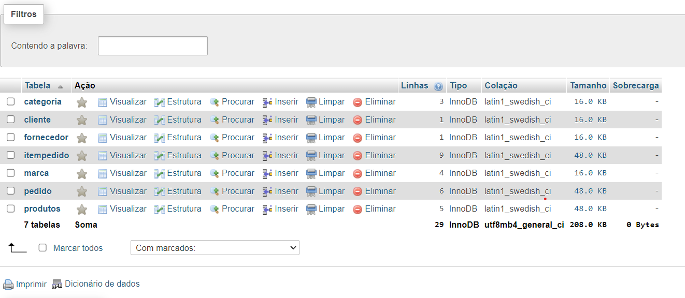
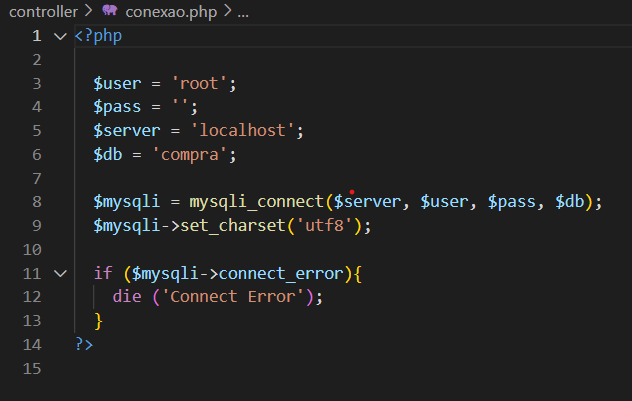
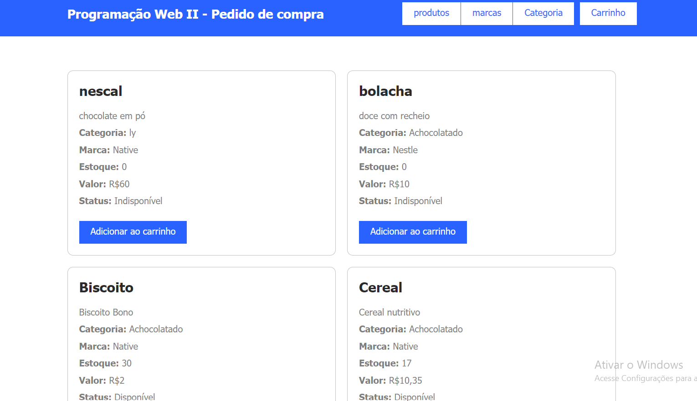

# 🔍 CadastroE

## 📋 Descrição 

Este projeto foi desenvolvido na disciplina de `Programação Web II` no `Colégio Marista Irmão Acácio`. Os arquivos desenvolvidos em PHP apresentam um site com características de e-commerce (site de compras), que oferece funcionalidades para dois tipos de usuários: `Comprador` e `Vendedor`, com essa atividade, aprendemos alguns códigos novos de php e a conexão com o banco de dados.

### 🖇️ Funcionalidades de Cada Usuário:
**Vendedor:** 
- Adicionar novos produtos, marcas ou categorias diretamente no banco de dados, acessa o próprio banco de dados para visualizar os itens que adicionou e visualizar todos os seus clientes, os pedidos e os itens dos pedidos.

**Comprador:** 
- Realiza compras e Acessar uma tela inicial com todos os itens disponíveis para compra (extraídos do banco de dados), exibindo características do produto como categoria, marca, quantidade em estoque, valor e disponibilidade (se o produto está disponível ou indisponível quando o estoque acabar).

### 📊 Banco de Dados
`Estrutura do Banco de Dados:`

**Tabelas:**   
Produtos  
Categorias  
Marcas  
Pedidos  
Itens dos Pedidos   
Usuários   

**PhpMyAdmin/Código**   

## 🛠️ Tecnologias Utilizadas

- GitHub
- HTML5
- PHP
- CSS
- PHPMyAdmin

## 👀 Visual do Site
**Página Inicial**  
 

**Exemplo de Cadastro de Produto**   

## Métodos Utilizados

## Métodos ultilizados
**include_once:** *Inclui e avalia o arquivo especificado durante a execução do script. Garante que o arquivo será incluído apenas uma vez, mesmo que seja chamado várias vezes, evitando duplicação de código.*

**include:** *Inclui e avalia o arquivo especificado durante a execução do script. Se o arquivo não for encontrado, gera um aviso, mas o script continua a execução.*

**while:** *Estrutura de repetição que executa um bloco de código enquanto uma condição especificada for verdadeira.*

**require_once:** *Inclui e avalia o arquivo especificado durante a execução do script. Garante que o arquivo será incluído apenas uma vez, semelhante ao include_once, mas se o arquivo não for encontrado, gera um erro fatal e interrompe a execução do script.*

**session_start():** *Inicia uma nova sessão ou resume uma sessão existente, permitindo o uso de variáveis de sessão para armazenar informações entre diferentes páginas.*

**mysqli_fetch_object:** *Retorna a próxima linha de um conjunto de resultados como um objeto, permitindo acesso às colunas do resultado como propriedades do objeto.*

**for:** *Estrutura de repetição que executa um bloco de código um número específico de vezes, controlado por uma variável contadora.*

**mysqli_connect:** *Estabelece uma nova conexão com o servidor MySQL, utilizando os parâmetros fornecidos como host, nome de usuário, senha e nome do banco de dados.*

**set_charset:** *Define o conjunto de caracteres padrão do cliente para a conexão MySQL, garantindo que a comunicação com o banco de dados utilize a codificação correta.*

**connect_error:** *Propriedade que retorna uma string contendo a descrição do erro de conexão, se a tentativa de conexão com o banco de dados falhar.*

**mysqli_error:** *Retorna uma string com a descrição do erro mais recente para a conexão ou consulta MySQL, facilitando a depuração de problemas.*

**mysqli_close($mysqli):** *Encerra a conexão com o servidor MySQL associada ao identificador fornecido, liberando os recursos associados à conexão.*

## ✒️ Autor
### ⚠️ Este código não é de minha autoria; foi desenvolvido em sala de aula e disponibilizado pelo professor.

meu git:  
[ Emilly Caroline ](https://github.com/emillycaaroline)   

